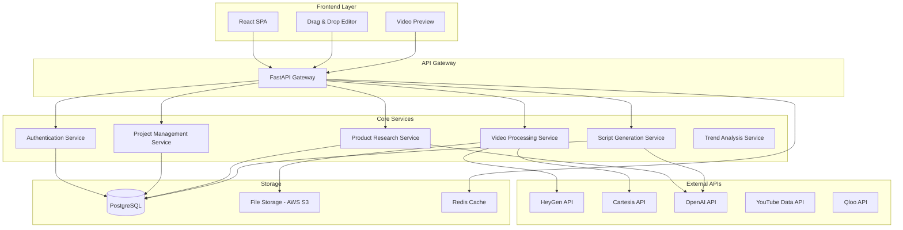

# Design Document

## Overview

KIRO CREATE is a web-based platform that orchestrates multiple AI services to automate video ad creation with virtual influencers. The system follows a microservices architecture with a React-based frontend, Node.js backend services, and integration with external AI APIs (HeyGen for video generation, Cartesia for voice synthesis). The platform emphasizes real-time collaboration, drag-and-drop functionality, and seamless workflow automation.

## Architecture

### High-Level Architecture



### Technology Stack

**Frontend:**
- React 20 with TypeScript
- React DnD for drag-and-drop functionality
- Fabric.js for canvas-based video timeline editor
- Socket.io-client for real-time updates
- Tailwind CSS for styling
- Zustand for state management

**Backend:**
- Python with FastAPI
- Pydantic for data validation and type safety
- WebSockets for real-time communication
- Celery with Redis for background job processing
- SQLAlchemy ORM for database operations

**Database & Storage:**
- PostgreSQL for relational data
- Redis for caching and session management
- AWS S3 for file storage
- CloudFront CDN for asset delivery

**External Integrations:**
- HeyGen API for video generation
- Cartesia API for voice synthesis (GPU-accelerated)
- OpenAI API for product research and script generation
- YouTube Data API for trending content analysis
- Qloo API for cultural intelligence and trend insights

## Components and Interfaces

### Frontend Components

#### 1. Project Dashboard
- **Purpose**: Central hub for project management
- **Key Features**: Project grid, search/filter, creation wizard
- **State Management**: Project list, user preferences, recent activity

#### 2. Drag & Drop Editor
- **Purpose**: Visual video composition interface
- **Key Features**: Timeline editor, component library, real-time preview
- **Libraries**: React DnD, Fabric.js for canvas manipulation
- **State**: Timeline data, selected components, undo/redo stack

#### 3. Product Research Interface
- **Purpose**: Product information input and analysis
- **Key Features**: URL input, manual entry forms, analysis results display
- **Integration**: Real-time API calls to product research service

#### 4. Influencer Gallery
- **Purpose**: Virtual influencer selection and preview
- **Key Features**: Grid layout, filtering, detailed preview modals
- **Data**: Influencer profiles, voice samples, personality traits

#### 5. Script Editor
- **Purpose**: AI-generated script review and editing
- **Key Features**: Rich text editor, multiple variations, voice preview
- **Integration**: Real-time script generation and voice synthesis preview

### Backend Services

#### 1. Authentication Service
```python
class AuthService:
    async def register(self, user_data: UserRegistration) -> User:
        ...
    
    async def login(self, credentials: LoginCredentials) -> AuthToken:
        ...
    
    async def validate_token(self, token: str) -> User:
        ...
    
    async def refresh_token(self, refresh_token: str) -> AuthToken:
        ...
```

#### 2. Project Management Service
```python
class ProjectService:
    async def create_project(self, project_data: ProjectCreation) -> Project:
        ...
    
    async def get_projects(self, user_id: str) -> list[Project]:
        ...
    
    async def update_project(self, project_id: str, updates: ProjectUpdate) -> Project:
        ...
    
    async def delete_project(self, project_id: str) -> None:
        ...
    
    async def get_project_assets(self, project_id: str) -> ProjectAssets:
        ...
```

#### 3. Product Research Service
```python
class ProductResearchService:
    async def analyze_product_url(self, url: str) -> ProductAnalysis:
        ...
    
    async def analyze_product_data(self, product_data: ProductInput) -> ProductAnalysis:
        ...
    
    async def extract_key_selling_points(self, analysis: ProductAnalysis) -> list[SellingPoint]:
        ...
    
    async def identify_target_audience(self, analysis: ProductAnalysis) -> TargetAudience:
        ...
```

#### 4. Script Generation Service
```python
class ScriptService:
    async def generate_scripts(
        self,
        product_analysis: ProductAnalysis,
        influencer: Influencer,
        options: ScriptOptions
    ) -> list[Script]:
        ...
    
    async def refine_script(self, script_id: str, feedback: str) -> Script:
        ...
    
    async def validate_script(self, script: Script, influencer: Influencer) -> ValidationResult:
        ...
```

#### 5. Video Processing Service
```python
class VideoService:
    async def generate_video(
        self,
        script: Script,
        influencer: Influencer,
        options: VideoOptions
    ) -> VideoJob:
        ...
    
    async def get_video_status(self, job_id: str) -> VideoJobStatus:
        ...
    
    async def add_b_roll(self, video_id: str, broll_assets: list[BRollAsset]) -> VideoJob:
        ...
    
    async def export_video(self, video_id: str, format: ExportFormat) -> ExportJob:
        ...
    
    async def allocate_gpu_resources(self, job_type: str, priority: int) -> GPUAllocation:
        ...
```

#### 6. Trend Analysis Service
```python
class TrendAnalysisService:
    async def get_youtube_trends(self, category: str = None, region: str = None) -> list[YouTubeTrend]:
        ...
    
    async def analyze_trending_content(self, video_ids: list[str]) -> TrendAnalysis:
        ...
    
    async def get_qloo_insights(self, product_category: str) -> QlooInsights:
        ...
    
    async def generate_trend_based_recommendations(
        self,
        product_analysis: ProductAnalysis,
        trends: TrendAnalysis
    ) -> TrendRecommendations:
        ...
    
    async def track_trend_performance(self, trend_id: str) -> TrendPerformance:
        ...
```

## Data Models

### Core Entities

```typescript
interface User {
  id: string
  email: string
  name: string
  subscription: SubscriptionTier
  createdAt: Date
  updatedAt: Date
}

interface Project {
  id: string
  userId: string
  name: string
  description?: string
  status: ProjectStatus
  productAnalysis?: ProductAnalysis
  selectedInfluencer?: Influencer
  scripts: Script[]
  videos: Video[]
  createdAt: Date
  updatedAt: Date
}

interface ProductAnalysis {
  id: string
  projectId: string
  productName: string
  description: string
  features: string[]
  pricing?: PricingInfo
  targetAudience: TargetAudience
  sellingPoints: SellingPoint[]
  sourceUrl?: string
  createdAt: Date
}

interface Influencer {
  id: string
  name: string
  description: string
  personality: PersonalityTraits
  voiceProfile: VoiceProfile
  visualProfile: VisualProfile
  sampleContent: string[]
  isActive: boolean
}

interface Script {
  id: string
  projectId: string
  content: string
  duration: number
  influencerId: string
  version: number
  isFinalized: boolean
  createdAt: Date
}

interface Video {
  id: string
  projectId: string
  scriptId: string
  status: VideoStatus
  heygenJobId?: string
  cartesiaJobId?: string
  videoUrl?: string
  audioUrl?: string
  brollAssets: BRollAsset[]
  exportFormats: ExportedVideo[]
  createdAt: Date
}
```

### Supporting Types

```typescript
type ProjectStatus = 'draft' | 'in_progress' | 'completed' | 'archived'
type VideoStatus = 'pending' | 'generating' | 'processing' | 'completed' | 'failed'
type SubscriptionTier = 'free' | 'pro' | 'enterprise'

interface TargetAudience {
  demographics: string[]
  interests: string[]
  painPoints: string[]
  preferredChannels: string[]
}

interface PersonalityTraits {
  tone: string
  style: string
  expertise: string[]
  communicationStyle: string
}

interface VoiceProfile {
  cartesiaVoiceId: string
  pitch: number
  speed: number
  emotion: string
  gpuRequirements?: GPURequirements
}

interface BRollAsset {
  id: string
  url: string
  duration: number
  startTime: number
  endTime: number
  type: 'product' | 'lifestyle' | 'background'
}

interface YouTubeTrend {
  id: string
  title: string
  channelTitle: string
  viewCount: number
  likeCount: number
  commentCount: number
  publishedAt: Date
  category: string
  tags: string[]
  thumbnailUrl: string
  duration: string
  trendScore: number
}

interface TrendAnalysis {
  id: string
  analyzedAt: Date
  topTopics: string[]
  popularHashtags: string[]
  contentStyles: ContentStyle[]
  audienceEngagement: EngagementMetrics
  recommendedApproaches: string[]
}

interface QlooInsights {
  id: string
  category: string
  culturalMoments: CulturalMoment[]
  audienceAffinities: AudienceAffinity[]
  contentRecommendations: ContentRecommendation[]
  seasonalTrends: SeasonalTrend[]
  generatedAt: Date
}

interface GPURequirements {
  minVRAM: number
  preferredGPUType: string
  concurrentJobs: number
  processingTimeEstimate: number
}

interface GPUAllocation {
  allocated: boolean
  instanceId?: string
  estimatedStartTime: Date
  priority: number
  queuePosition?: number
}

interface TrendRecommendations {
  id: string
  productId: string
  recommendedTopics: string[]
  suggestedHashtags: string[]
  optimalPostingTimes: TimeSlot[]
  contentAngles: ContentAngle[]
  influencerMatches: InfluencerMatch[]
}

interface ContentStyle {
  name: string
  frequency: number
  examples: string[]
  effectiveness: number
}

interface EngagementMetrics {
  averageViewDuration: number
  clickThroughRate: number
  shareRate: number
  commentEngagement: number
}

interface CulturalMoment {
  name: string
  relevanceScore: number
  timeframe: string
  associatedTopics: string[]
}

interface AudienceAffinity {
  demographic: string
  interests: string[]
  platforms: string[]
  engagementPatterns: string[]
}
```

## Error Handling

### Error Categories

1. **Validation Errors**: Input validation failures, malformed data
2. **Authentication Errors**: Invalid credentials, expired tokens
3. **External API Errors**: HeyGen, Cartesia, OpenAI service failures
4. **Processing Errors**: Video generation failures, script processing issues
5. **Storage Errors**: File upload/download failures, database connection issues

### Error Response Format

```typescript
interface ErrorResponse {
  error: {
    code: string
    message: string
    details?: any
    timestamp: string
    requestId: string
  }
}
```

### Retry Strategies

- **External API Calls**: Exponential backoff with jitter (max 3 retries)
- **File Operations**: Linear retry with 1-second intervals (max 5 retries)
- **Database Operations**: Immediate retry once, then fail fast
- **Video Processing**: Queue-based retry with increasing delays

### Graceful Degradation

- **Offline Mode**: Cache project data locally, sync when connection restored
- **API Failures**: Provide manual alternatives for automated features
- **Partial Failures**: Allow users to continue with completed components

## Testing Strategy

### Unit Testing
- **Coverage Target**: 80% minimum for core business logic
- **Framework**: Jest with TypeScript support
- **Focus Areas**: Service layer logic, data transformations, validation functions

### Integration Testing
- **API Testing**: Supertest for endpoint testing
- **Database Testing**: Test database with Docker containers
- **External API Mocking**: Mock HeyGen, Cartesia, and OpenAI responses

### End-to-End Testing
- **Framework**: Playwright for cross-browser testing
- **Critical Paths**: Complete video creation workflow, user authentication, project management
- **Performance Testing**: Load testing for video processing queues

### Testing Data
- **Mock Influencers**: Pre-defined test influencer profiles
- **Sample Products**: Test product data for consistent testing
- **Video Assets**: Small test videos for processing validation

### Continuous Integration
- **Pre-commit Hooks**: Linting, type checking, unit tests
- **CI Pipeline**: Full test suite on pull requests
- **Deployment Testing**: Smoke tests on staging environment

## Performance Considerations

### Frontend Optimization
- **Code Splitting**: Route-based and component-based lazy loading
- **Asset Optimization**: Image compression, video thumbnail generation
- **Caching Strategy**: Service worker for offline functionality
- **Bundle Size**: Target <500KB initial bundle size

### Backend Optimization
- **Database Indexing**: Optimize queries for project and video retrieval
- **Caching Layer**: Redis for frequently accessed data
- **Queue Management**: Bull queues for background video processing
- **Rate Limiting**: Protect against API abuse

### Video Processing
- **Async Processing**: All video operations handled via background queues
- **Progress Tracking**: Real-time updates via WebSocket connections
- **Resource Management**: Limit concurrent video generation jobs
- **CDN Integration**: CloudFront for fast video delivery

### Scalability Planning
- **Horizontal Scaling**: Stateless services for easy scaling
- **Database Sharding**: Plan for user-based data partitioning
- **Microservice Architecture**: Independent scaling of core services
- **Load Balancing**: Application-level load balancing for video processing